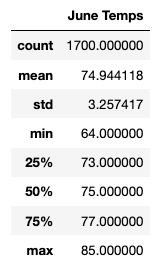
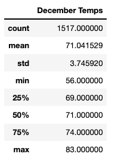
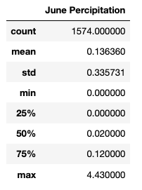
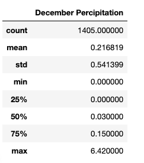

# Surfs-Up

## Overview of the analysis:

The goal of this project is to analyze temperature data in Oahu, in order to determine if a surf and ice cream shop business is sustainable year-round.  Our data has been stored in a SQLite database and we used SQLAlchemy to execute queries for our analysis.  We will pay close attention to the months of June and December.  Our queries are particularly focused on temperature and percipitation amouns in the city of Oahu.

## Results:

- The average temperature for the month of June is 3.903 degrees higher than December
- The minimum temperature in December is 8 degrees lower than the temperature in June
- The maximum temperature in June is 2 degrees higher than the maximum temperature in December

 * June Temps
 
    

 * December Temps

     
 

 
 
## Summary:
In summary the diffeneces between the temperatures in June and December are not great enough to deter investing in Surf n Shake.  In addition to perform temperature analysis we also analyzed Percipitation differences in June and December.   The summary of our finidngs are below.

 * June Percipitation

    
 

 * December Percipitation

    

